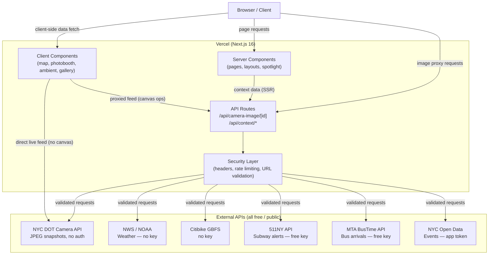
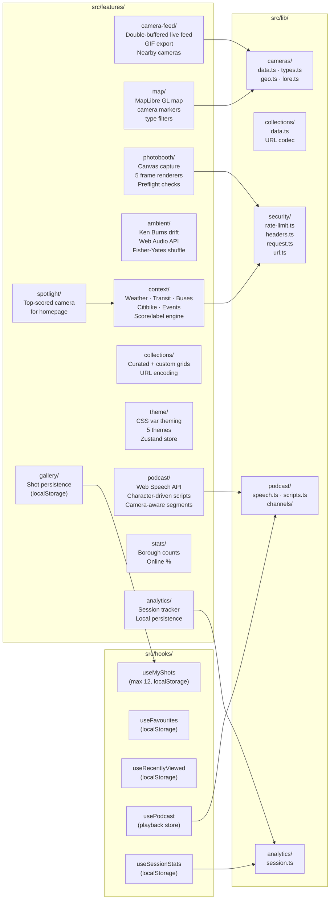
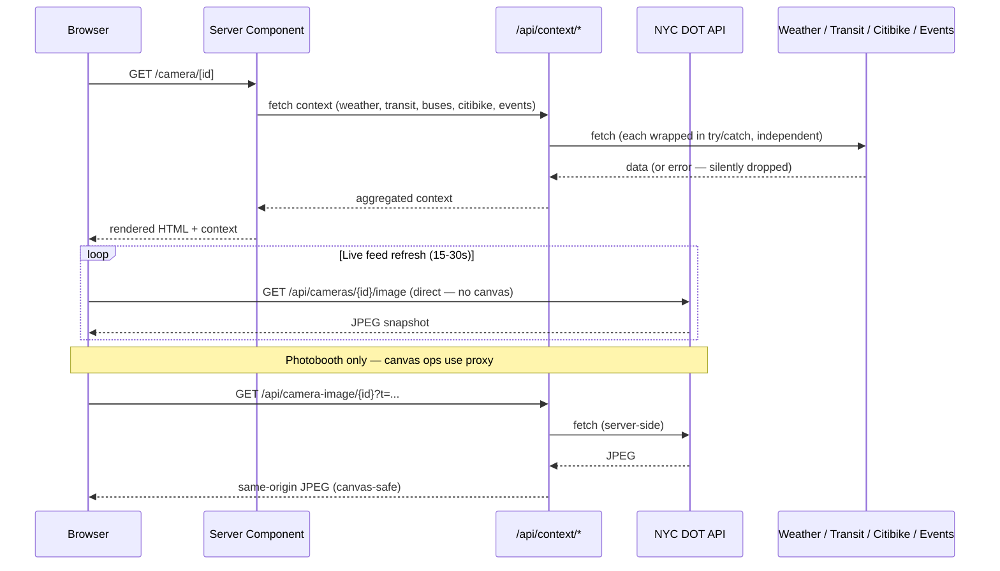
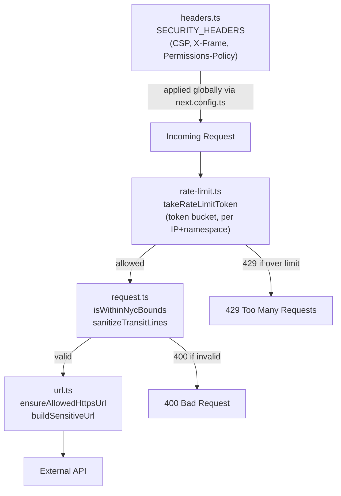

# NycGrid Architecture

## Overview

NycGrid is a Next.js 16 App Router application that surfaces NYC's 959 public DOT traffic cameras as an interactive, creative experience — live map exploration, ambient mode, photobooth, collections, and a rich per-camera context panel.

---

## System Overview



---

## Route Map

| Route                    | Type          | Rendering                  | Description                                     |
| ------------------------ | ------------- | -------------------------- | ----------------------------------------------- |
| `/`                      | Page          | Server + ISR               | Landing page with top-scored camera spotlight   |
| `/explore`               | Page          | Server (map island client) | Full-screen MapLibre camera map                 |
| `/ambient`               | Page          | Client                     | Ken Burns camera drift with audio               |
| `/camera/[id]`           | Page          | Server                     | Full-screen live feed + context panel           |
| `/photobooth/[id]`       | Page          | Client                     | Canvas photobooth with 5 frame styles           |
| `/gallery`               | Page          | Client                     | localStorage shot gallery                       |
| `/collections`           | Page          | Server                     | Curated collection index                        |
| `/collections/[slug]`    | Page          | Server                     | Named collection grid (up to 9 cameras)         |
| `/collections/build`     | Page          | Client                     | Custom collection builder                       |
| `/collections/custom`    | Page          | Server + Client            | Custom collection view via `?c=` param          |
| `/stats`                 | Page          | Server                     | Per-borough camera count and online % dashboard |
| `/about`                 | Page          | Server                     | Project info                                    |
| `/legal/privacy`         | Page          | Server                     | Privacy policy                                  |
| `/legal/terms`           | Page          | Server                     | Terms of service                                |
| `/api/camera-image/[id]` | Route Handler | Edge/Server                | Same-origin JPEG proxy for canvas capture       |
| `/api/context/weather`   | Route Handler | Server                     | NWS weather by lat/lng                          |
| `/api/context/transit`   | Route Handler | Server                     | 511NY subway alerts by lines                    |
| `/api/context/citibike`  | Route Handler | Server                     | Citibike station availability by lat/lng        |
| `/api/context/events`    | Route Handler | Server                     | NYC Open Data permitted events by borough       |

---

## Feature Map



---

## Data Flow



---

## Security Layer

All API routes pass through `src/lib/security/` before touching external services.



**Rate limits per route:**

| Route                    | Limit     | Window |
| ------------------------ | --------- | ------ |
| `/api/camera-image/[id]` | 60 req/IP | 1 min  |
| `/api/context/weather`   | 30 req/IP | 1 min  |
| `/api/context/citibike`  | 30 req/IP | 1 min  |
| `/api/context/events`    | 30 req/IP | 1 min  |
| `/api/context/transit`   | 20 req/IP | 1 min  |

---

## Canvas / Photobooth

Camera images from DOT are cross-origin. `canvas.toBlob()` throws a security error if a cross-origin image taints the canvas. The proxy route solves this:

```
Direct URL:  https://webcams.nyctmc.org/api/cameras/{id}/image
             → fast, use for  display only

Proxy URL:   /api/camera-image/{id}?t={timestamp}
             → server-fetches DOT, returns from app origin
             → use whenever image touches canvas (photobooth, GIF export)
```

Rule: if an `` will ever be passed to `ctx.drawImage()`, it **must** go through the proxy. Use `proxiedImageUrl(id)` from `src/lib/cameras/types.ts`.

### Component audit — why every proxy usage is load-bearing

All proxy usages were audited in April 2026. None can be switched to direct DOT URLs.

| Component                                             | Proxy needed?       | Reason                                                                                                                              |
| ----------------------------------------------------- | ------------------- | ----------------------------------------------------------------------------------------------------------------------------------- |
| `FrameDiff`                                           | Yes — CORS          | Calls `ctx.getImageData()` on canvas                                                                                                |
| `CameraImage`                                         | Yes — CORS          | Looks display-only, but `onFrameLoad` → `useFrameBuffer.captureFrame()` → `drawImage()` + `getImageData()` (GIF export)             |
| `PhotoboothClient`                                    | Yes — CORS          | `useCapture` draws images to canvas + `toDataURL()`                                                                                 |
| `AmbientPlayer` (`windowedProxiedImageUrl`, line 393) | Yes — rate limiting | Display-only (no CORS issue), but the windowed URL collapses all user requests within a 10s window into a single upstream DOT fetch |

`CameraImage` is the non-obvious one: it only renders `` tags, but its `onFrameLoad` callback passes the `HTMLImageElement` to `useFrameBuffer`, which draws it to a canvas for GIF export. Switching it to a direct URL would taint that canvas.

`AmbientPlayer`'s windowed proxy is not a CORS fix — it's a responsible API usage optimization. Removing it would increase fan-out to DOT with no UX benefit.

---

## Theme System

CSS custom properties on the `[data-theme]` attribute of `<html>`. Five themes: `street`, `hacker`, `brutalist`, `pastel`, `light`. Persisted to localStorage via `useThemeStore` (Zustand, key: `nycgrid-theme`).

Anti-flicker inline script in `<head>` reads `nycgrid-theme` from localStorage and sets `data-theme` before first paint.

---

## Ambient Mode

```
AmbientPlayer (client component)
  ├── Fisher-Yates shuffle of CAMERAS array
  ├── Two image slots (A/B) — one visible, one preloading
  ├── Ken Burns CSS animation (random pan/zoom per slot)
  ├── useAmbientAudio — Web Audio API procedural soundscape
  │     triggered by camera tags (bridge, highway, water) + weather condition
  └── Weather integration — fetches NWS data for current camera location
```

---

## Context Panel

Each camera detail page fetches context data server-side. All fetches are independent — a failure in one (e.g. 511NY down) does not block the others.

```
fetchCameraContext(camera)
  ├── fetchWeather(lat, lng)      → NWS forecast (revalidate 600s)
  ├── fetchTransit(lines)         → 511NY service alerts (revalidate 120s)
  ├── fetchBusArrivals(lat, lng)  → MTA BusTime stop monitor (revalidate 30s)
  ├── fetchCitibike(lat, lng)     → GBFS station status (revalidate 60s)
  └── fetchEvents(borough)        → NYC Open Data permits (revalidate 3600s)
```

---

## Collections

Collections are encoded in URL query strings for zero-backend sharing.

```
/collections/custom?c=abc123,def456,ghi789
                     └── comma-separated camera IDs
                         decoded by decodeCameraIds() in src/lib/collections/data.ts
```

Curated collections live in `src/lib/collections/data.ts` as a typed static array with a `slug`, `name`, `description`, and camera ID list.

---

## Key Constraints

- **Vercel Hobby**: 100GB bandwidth, 10s function timeout — keep route handlers fast
- **DOT cameras**: JPEG snapshots only (not MJPEG/video) — client controls refresh rate
- **Cross-origin images**: always proxy through `/api/camera-image/[id]` for canvas ops
- **In-memory rate limiter**: resets on cold start — acceptable for Hobby tier, replace with Redis for production scale
- **LocalStorage persistence**: shots, favourites, recently viewed — no backend required for Phase 1
